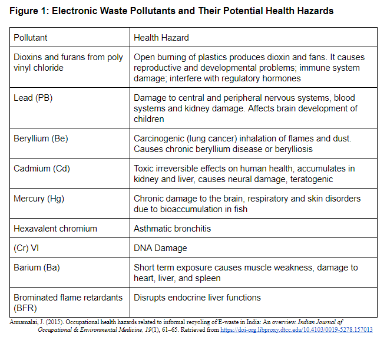

# Impacts on Human Health

The human brain. Retrieved from [https://img.purch.com/w/660/aHR0cDovL3d3dy5saXZlc2NpZW5jZS5jb20vaW1hZ2VzL2kvMDAwLzAzOS84NDcvb3JpZ2luYWwvc2h1dHRlcnN0b2NrXzEwMTAwMDcwNy5qcGc=](https://img.purch.com/w/660/aHR0cDovL3d3dy5saXZlc2NpZW5jZS5jb20vaW1hZ2VzL2kvMDAwLzAzOS84NDcvb3JpZ2luYWwvc2h1dHRlcnN0b2NrXzEwMTAwMDcwNy5qcGc=)
{: .fs-3 }

The creation of electronic waste in developing countries can have many negative impacts due to the materials that electronics are composed of. Various metals and other substances that comprise electronic waste, including mercury, lead, and cadmium are hazardous to human health (Seeberger et al., 2016, p. 8, Introduction section, para. 3). Lead, for example, is known to have harmful, irreversible impacts on human health. High amounts of lead in the body can cause permanent damage to the kidneys and nervous system (Annamalai, 2015, p. 63, Health Risks of Lead Exposure section, para. 1).  Unfortunately, current electronic waste handling allows for the emission of these toxic substances into the environment, causing pollution that results in increased human exposure above safe levels. Figure 1 contains various substances present in electronic waste and their health hazards. Additionally, sources of drinking water have the potential to become contaminated and unsafe for human consumption, leading to water shortages resulting from the environmental pollution caused by informal electronic waste handling practices. Guiyu, China is an example of one such area suffering from water shortages due to informal electronic waste handling (Borthakur, 2016, p. 22, Water Pollution section, para. 3). 

