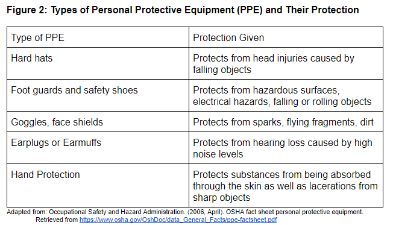

# PPE Programs

Some examples of PPE. Retrieved from https://sc02.alicdn.com/kf/HTB1YYR3txSYBuNjSsphq6zGvVXaA/safety-equipment-production-supplier.jpg
{: .fs-3 }

More developed countries, specifically the United States, already have legislation and other procedures in place in order to mitigate the negative impacts that electronic waste handling can potentially have on human health. Many of these procedures have shown results in decreasing these negative impacts (Heeks, Subramanian, & Jones, 2015, p. 654, Introduction section, para. 4). Developing countries should imitate these procedures and implement them in areas struggling with the negative implications brought about by informal electronic waste handling. One such procedure in place meant to protect the health of workers when at risk of exposure to toxic substances is the implementation of a Personal Protective Equipment (PPE) program in the workplace. The Occupational Safety and Health Administration, located in the United States, has various guidelines outlining the proper implementation of PPE programs to protect worker health. PPE programs are meant to educate employees on the proper types of PPE to wear while working, the potential hazards workers may be exposed to, and how to wear PPE to most minimize health and safety risks (Occupational Safety and Health Administration, n.d.b., Overview section, para. 2-3). 

Examples of PPE include hard hats, face shields, and earplugs. Figure 2 displays examples of PPE and their protection. It is important to note the effectiveness of the implementation of PPE programs in workplaces across the United States. These procedures have decreased worker injuries and illnesses from 10.9 incidents per 100 workers in 1972 to 2.8 incidents per 100 workers in 2017 in the United States (Occupational Safety and Health Administration, n.d.a., OSHA is Making a Difference section, para. 1). Thus, workplaces in developing countries that deal with the handling of electronic waste could benefit greatly from the implementation of PPE programs, especially in the reduction of workplace injuries.

